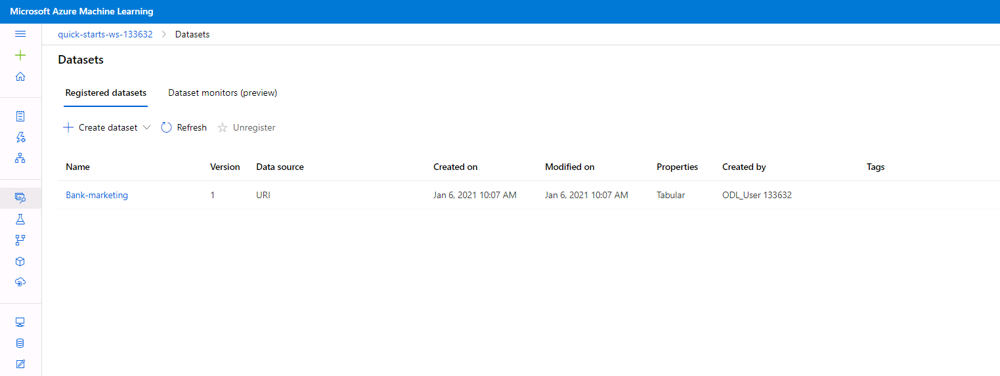
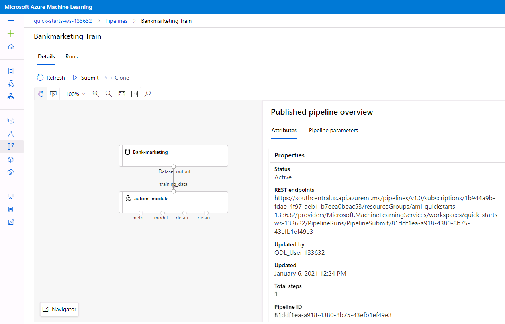

# Operationalizing Machine Learning

This project uses Azure Machine Learning to configure a cloud-based machine learning production model, deploy it, and consume it. Pipeline is also created using SDK, published and consumed.

Steps that are followed:

* Authentication
* Automated ML Experiment  
* Deploy the best model
* Enable logging  
* Swagger Documentation
* Consume model endpoints  
* Create and publish a pipeline  
* Documentation

## Architectural Diagram

## Key Steps
### Step 1: Authentication
In this step, service principal ml-auth was to be created, but since the project was executed in Udacity Azure Workspace, the authentication step was already part of the setup.
### Step 2: Automated ML Experiment
At first, dataset used in this project was uploaded to Azure workspace. Dataset contains data about marketing campaigns in banking institution and objective was to predict if marketing campaign was successful, meaning if contacted customer subscribed to product ('yes') or not ('no').

After dataset registration, AutoML experiment was created with task type - Classification. 

Best model was VotingEnsemble classifier with accuracy of 92%.

### Step 3: Deploy the best model
In this step best model was deployed. Deployment allows to interact with the HTTP API service and interact with the model by sending data over POST requests.

### Step 4: Enable logging
After the deployment, Application Insights service was enabled and logs retrived. At first config.json was downloaded from the Azure Workspace. Then logs.py script was updated with the details of the deployement, and attribute enable_app_insights was set to True. After those steps python script was run:

Applications Insights enabled:

### Step 5: Swagger Documentation
In this step, deployed model was consumed using Swagger. Azure provides a Swagger JSON file for deployed models. Swagger is then run locally using swagger.sh and serve.py script is executed to interact with Swagger instance and send request using HTTP POST method. 

### Step 6: Consume model endpoints
After the deployment we can interact with trained model and send data for scoring. Using endpoint.py file sample features are sent via POST method and result is returned.

Also as optional step we can benchmark the endpoint using Apache Benchmark and runing benchmark script.

### Step 7: Create and publish a pipeline
In this step Azure SDK is used to create, publish and consume a pipeline.

Pipeline created:

Pipeline endpoint:

Bankmarketing with AutoML module:

Published pipeline overview:

RunDetail widget:

Scheduled run:

## Screen Recording
https://www.youtube.com/watch?v=onmwoeLrca0

